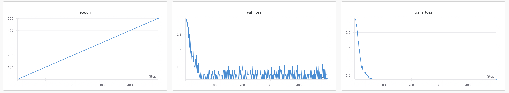
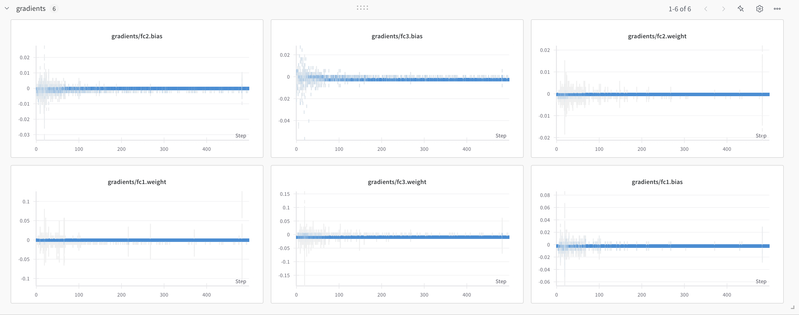
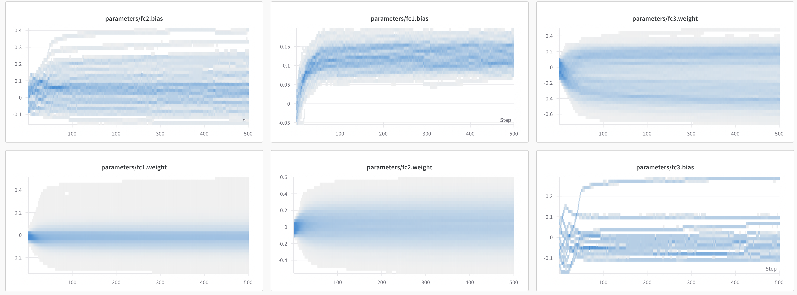
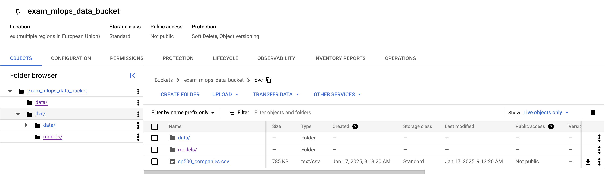
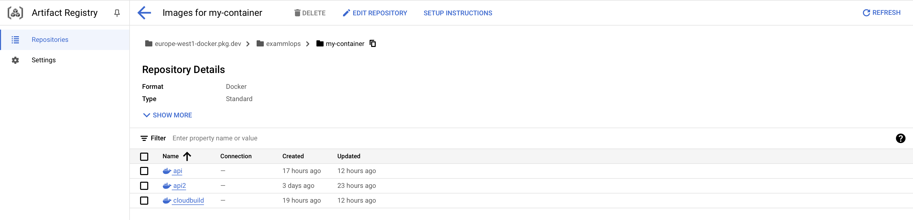
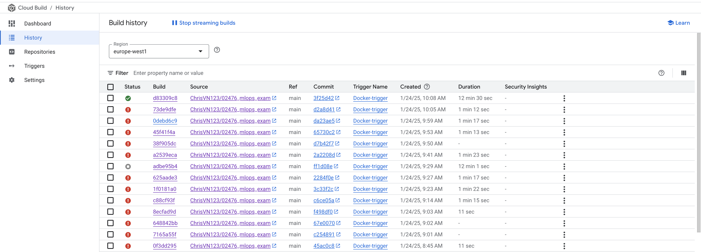
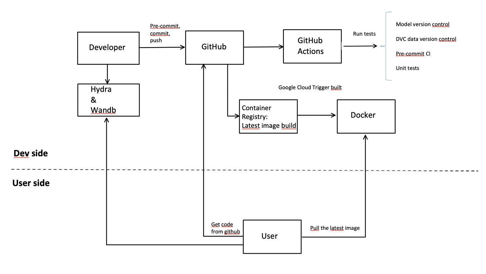

# Exam template for 02476 Machine Learning Operations

This is the report template for the exam. Please only remove the text formatted as with three dashes in front and behind
like:

```--- question 1 fill here ---```

Where you instead should add your answers. Any other changes may have unwanted consequences when your report is
auto-generated at the end of the course. For questions where you are asked to include images, start by adding the image
to the `figures` subfolder (please only use `.png`, `.jpg` or `.jpeg`) and then add the following code in your answer:

```markdown

```

In addition to this markdown file, we also provide the `report.py` script that provides two utility functions:

Running:

```bash
python report.py html
```

Will generate a `.html` page of your report. After the deadline for answering this template, we will auto-scrape
everything in this `reports` folder and then use this utility to generate a `.html` page that will be your serve
as your final hand-in.

Running

```bash
python report.py check
```

Will check your answers in this template against the constraints listed for each question e.g. is your answer too
short, too long, or have you included an image when asked. For both functions to work you mustn't rename anything.
The script has two dependencies that can be installed with

```bash
pip install typer markdown
```

## Overall project checklist

The checklist is *exhaustive* which means that it includes everything that you could do on the project included in the
curriculum in this course. Therefore, we do not expect at all that you have checked all boxes at the end of the project.
The parenthesis at the end indicates what module the bullet point is related to. Please be honest in your answers, we
will check the repositories and the code to verify your answers.

### Week 1

* [X] Create a git repository (M5)
* [X] Make sure that all team members have write access to the GitHub repository (M5)
* [X] Create a dedicated environment for you project to keep track of your packages (M2)
* [X] Create the initial file structure using cookiecutter with an appropriate template (M6)
* [X] Fill out the `data.py` file such that it downloads whatever data you need and preprocesses it (if necessary) (M6)
* [X] Add a model to `model.py` and a training procedure to `train.py` and get that running (M6)
* [X] Remember to fill out the `requirements.txt` and `requirements_dev.txt` file with whatever dependencies that you
    are using (M2+M6)
* [X] Remember to comply with good coding practices (`pep8`) while doing the project (M7)
* [X] Do a bit of code typing and remember to document essential parts of your code (M7)
* [X] Setup version control for your data or part of your data (M8)
* [X] Add command line interfaces and project commands to your code where it makes sense (M9)
* [X] Construct one or multiple docker files for your code (M10)
* [X] Build the docker files locally and make sure they work as intended (M10)
* [X] Write one or multiple configurations files for your experiments (M11)
* [X] Used Hydra to load the configurations and manage your hyperparameters (M11)
* [X] Use profiling to optimize your code (M12)
* [X] Use logging to log important events in your code (M14)
* [X] Use Weights & Biases to log training progress and other important metrics/artifacts in your code (M14)
* [X] Consider running a hyperparameter optimization sweep (M14)
* [ ] Use PyTorch-lightning (if applicable) to reduce the amount of boilerplate in your code (M15)

### Week 2

* [X] Write unit tests related to the data part of your code (M16) 
* [X] Write unit tests related to model construction and or model training (M16) 
* [X] Calculate the code coverage (M16) 
* [X] Get some continuous integration running on the GitHub repository (M17) 
* [X] Add caching and multi-os/python/pytorch testing to your continuous integration (M17)
* [X] Add a linting step to your continuous integration (M17) 
* [X] Add pre-commit hooks to your version control setup (M18)
* [X] Add a continues workflow that triggers when data changes (M19)
* [X] Add a continues workflow that triggers when changes to the model registry is made (M19) 
* [X] Create a data storage in GCP Bucket for your data and link this with your data version control setup (M21)
* [X] Create a trigger workflow for automatically building your docker images (M21) 
* [X] Get your model training in GCP using either the Engine or Vertex AI (M21) 
* [X] Create a FastAPI application that can do inference using your model (M22)  
* [X] Deploy your model in GCP using either Functions or Run as the backend (M23)
* [X] Write API tests for your application and setup continues integration for these (M24)
* [ ] Load test your application (M24)
* [X] Create a more specialized ML-deployment API using either ONNX or BentoML, or both (M25)
* [ ] Create a frontend for your API (M26)

### Week 3

* [X] Check how robust your model is towards data drifting (M27)
* [ ] Deploy to the cloud a drift detection API (M27)
* [ ] Instrument your API with a couple of system metrics (M28)
* [ ] Setup cloud monitoring of your instrumented application (M28)
* [X] Create one or more alert systems in GCP to alert you if your app is not behaving correctly (M28)
* [ ] If applicable, optimize the performance of your data loading using distributed data loading (M29)
* [ ] If applicable, optimize the performance of your training pipeline by using distributed training (M30)
* [ ] Play around with quantization, compilation and pruning for you trained models to increase inference speed (M31)

### Extra

* [ ] Write some documentation for your application (M32)
* [ ] Publish the documentation to GitHub Pages (M32)
* [X] Revisit your initial project description. Did the project turn out as you wanted?
* [ ] Create an architectural diagram over your MLOps pipeline
* [X] Make sure all group members have an understanding about all parts of the project
* [X] Uploaded all your code to GitHub

## Group information

### Question 1
> **Enter the group number you signed up on <learn.inside.dtu.dk>**
>
> Answer:

--- 24 ---

### Question 2
> **Enter the study number for each member in the group**
>
> Example:
>
> **
>
> Answer:

--- s201725, s224397, s224411 ---

### Question 3
> **A requirement to the project is that you include a third-party package not covered in the course. What framework**
> **did you choose to work with and did it help you complete the project?**
>
> Recommended answer length: 100-200 words.
>
> Example:
> *We used the third-party framework ... in our project. We used functionality ... and functionality ... from the*
> *package to do ... and ... in our project*.
>
> Answer:
> 
--- We used the third-party framework Mypy, a static type checker for Python code. It checks if the type annotations in the code match how variables and functions are actually used. This helps catch errors early and also makes the code easier to read and understand which was the main reason we decided to use it. We only applied Mypy to the src/exam_project folder. One limitation we faced was that some packages like sklearn, didn’t have .pyi stub files. These files are important because they provide the type information Mypy needs to work properly. Despite this, Mypy was a useful tool for improving the overall quality of our code. ---

## Coding environment

> In the following section we are interested in learning more about you local development environment. This includes
> how you managed dependencies, the structure of your code and how you managed code quality.

### Question 4

> **Explain how you managed dependencies in your project? Explain the process a new team member would have to go**
> **through to get an exact copy of your environment.**
>
> Recommended answer length: 100-200 words
>
> Example:
> *
>
> Answer:

--- We used Conda for managing our dependencies. The list of dependencies was auto-generated using "conda env export > environment.yml" To get a complete copy of our development environment, one would have to run the following commands: 
1. Install conda or miniconda
2. Clone the project repository
3. Create environment using conda env create -f environment.yml

If a new member does not want to use conda we added a requirements.txt file with all the dependencies listed. To install the dependencies one would have to run the following commands:
1. Create virtual environment
2. pip install -r requirements.txt

Furthermore, we specified a requirements_api.txt file which our api.dockerfile used to limit the size and run time of the docker file ---

### Question 5

> **We expect that you initialized your project using the cookiecutter template. Explain the overall structure of your**
> **code. What did you fill out? Did you deviate from the template in some way?**
>
> Recommended answer length: 100-200 words
>
> Example:
> *From the cookiecutter template we have filled out the ... , ... and ... folder. We have removed the ... folder*
> *because we did not use any ... in our project. We have added an ... folder that contains ... for running our*
> *experiments.*
>
> Answer:

--- We have used the cookiecutter template 'mlops_template' from https://github.com/SkafteNicki/mlops_template. 
We stuck to the template quite consistly and filled out all the folders from the template and almost only added extra folders when packages needed them such as the folder .dvc for our data version control setup,ruff_cahce for linting, .pytest_cahce for testing, configs for the configuration of the experiments etc. An exception to that is that we deleted the folder notebooks as we did not use jupyter notebook for this project. Furthermore, we also added a folder called logs in the reports folder to keep the logs from our training runs, and a folder performance_tests in the tests folder to keep the performance tests. ---


### Question 6

> **Did you implement any rules for code quality and format? What about typing and documentation? Additionally,**
> **explain with your own words why these concepts matters in larger projects.**
>
> Recommended answer length: 100-200 words.
>
> Example:
> *We used ... for linting and ... for formatting. We also used ... for typing and ... for documentation. These*
> *concepts are important in larger projects because ... . For example, typing ...*
>
> Answer:

--- We used ruff for linting and formating. We decidecd to use 120 characters as the maximum line length. We also used the package mypy for typing checks as described in Q3. When we are working with larger more complex projects, where more people are involved, a standard way of writing your code becomes crucial. The PEP8 style guide for python is a good example which is consistent with the default behaviour of ruff. When we have a standard way of linting, formatting and typing our code, it makes it much easier for anyone who at a later time has to read, understand and debug the code. Furthermore, IDEs can more effectively help with error detection when the code is formatted in a standard way. ---

## Version control

> In the following section we are interested in how version control was used in your project during development to
> corporate and increase the quality of your code.

### Question 7

> **How many tests did you implement and what are they testing in your code?**
>
> Recommended answer length: 50-100 words.
>
> Example:
> *In total we have implemented X tests. Primarily we are testing ... and ... as these the most critical parts of our*
> *application but also ... .*
>
> Answer:

--- In total we have implemented 8 tests divided across testing the data, the model, model perfomance and our api. They respectively focus on testing that the data is loaded and preprocessed correctly, that the model works as expected with regard to output shapes, gradient computation and saving, that the model is not too slow and that the api works as expected ---

### Question 8

> **What is the total code coverage (in percentage) of your code? If your code had a code coverage of 100% (or close**
> **to), would you still trust it to be error free? Explain you reasoning.**
>
> Recommended answer length: 100-200 words.
>
> Example:
> *The total code coverage of code is X%, which includes all our source code. We are far from 100% coverage of our **
> *code and even if we were then...*
>
> Answer:

--- The total code coverage of code is 87%, which only includes the files data.py, api.py, model.py, which means that the files evaluate.py, train_model.py and train.py is not tested which is a clear weakness of our test setup. Even if the code coverage had been 100% we are of course still not sure that the code will be error free, since this still depends on the tests actually covering all the different possible sources of errors. We might have tests which only tests for very specific errors such as the fact that our NN returns the correct model shape, but this does not ensure that the model cannot run into other errors. ---

### Question 9

> **Did you workflow include using branches and pull requests? If yes, explain how. If not, explain how branches and**
> **pull request can help improve version control.**
>
> Recommended answer length: 100-200 words.
>
> Example:
> *We made use of both branches and PRs in our project. In our group, each member had an branch that they worked on in*
> *addition to the main branch. To merge code we ...*
>
> Answer:

--- We created a branch each time we implemented a new feature and used pull requests to merge with the main branch. Working on different branches provide security to the main branch, such that what ends on the main branch is less likely to contain errors and it is more easy to restore a version which is functional should a bug occur. 

We made use of github actions on all the pull request to run linting, formatting and unit tests, to make sure that the code was following the standard and was working as expected. After merging the branch and main we deleted the branch to keep the workflow clean.  ---


### Question 10

> **Did you use DVC for managing data in your project? If yes, then how did it improve your project to have version**
> **control of your data. If no, explain a case where it would be beneficial to have version control of your data.**
>
> Recommended answer length: 100-200 words.
>
> Example:
> *We did make use of DVC in the following way: ... . In the end it helped us in ... for controlling ... part of our*
> *pipeline*
>
> Answer:

--- We did make use of DVC in the following way: We stored our data in google cloud buckets such that we did not need to store our data in github. Instead new users of our project can just dvc pull and github actions does this automatically when running the tests. We did not do that for the dockerfiles as the setup with providing a json key for GCloud seemeed a bit tricky, if we didn't want to risk making that json file avaible online through the docker image. To the extent we did use dvc it made our project more scalable and shareable as large data files would not be a problem to share, even as the data files grows in size. ---

### Question 11

> **Discuss you continuous integration setup. What kind of continuous integration are you running (unittesting,**
> **linting, etc.)? Do you test multiple operating systems, Python  version etc. Do you make use of caching? Feel free**
> **to insert a link to one of your GitHub actions workflow.**
>
> Recommended answer length: 200-300 words.
>
> Example:
> *We have organized our continuous integration into 3 separate files: one for doing ..., one for running ... testing*
> *and one for running ... . In particular for our ..., we used ... .An example of a triggered workflow can be seen*
> *here: <weblink>*
>
> Answer:

--- We have organized our continous integration into 5 seperate files. The first file, tests.yaml, is for the unit tests which runs on the latest versions of ubunti, windows and mac-os for both python 3.12 and 3.11. It downloads our data from the cloud and runs our tests through pytest and calculates the coverage. We also have a pre_commit.yaml file which runs the pre-commit check in github actions which we already use to check all of our commits. This extra step ensures that our linting an formatting is uniform. Our third file, staged_model.yaml runs a perfomance test if a new model is part of the pull request and stages that model and its performance to the wandb model registry. The fourth file, cloudbuild.yaml, only runs when new data is part of the pull request. In that case it analyzes the data through dataset_statistics.py and prints the result of that on the PR-page. Lastly, cloudbuild.yaml is used to build and push our docker images to GCP through GithubActions. We also use the standard dependabot.yaml to help with dependencies. We have used caches a lot, using 13 cahces actively, to make github actions run much more efficiently. An example of one of our triggered workflows can be seen here:
https://github.com/ChrisVN123/02476_mlops_exam/actions/workflows/cml_data.yaml ---

## Running code and tracking experiments

> In the following section we are interested in learning more about the experimental setup for running your code and
> especially the reproducibility of your experiments.

### Question 12

> **How did you configure experiments? Did you make use of config files? Explain with coding examples of how you would**
> **run a experiment.**
>
> Recommended answer length: 50-100 words.
>
> Example:
> *We used a simple argparser, that worked in the following way: Python  my_script.py --lr 1e-3 --batch_size 25*
>
> Answer:

--- We used a config.yaml file in the configs folder. It contains the different configurations we need for the different programs we want to run e.g. epochs and the optimizer used for training. This meant that one had to change the parameters in the .config.yaml file corresponding to a specific program before running the program. ---

### Question 13

> **Reproducibility of experiments are important. Related to the last question, how did you secure that no information**
> **is lost when running experiments and that your experiments are reproducible?**
>
> Recommended answer length: 100-200 words.
>
> Example:
> *We made use of config files. Whenever an experiment is run the following happens: ... . To reproduce an experiment*
> *one would have to do ...*
>
> Answer:

--- As mentioned we made use of config files. With the help of hydra after each run our configuration was saved in the outputs folder in a new folder based on the time and date of the run. Here one .hydra folder was created containing our hydra and config.yaml configuration. Furthermore, a wandb folder is created, which contains our requirements file used on that run, any models created, as well as a .dvc file to track the new picked version of our model and a data.dvc file such that we know what data file was used (this data file is then pushed to GCloud bucket). A clear improvement would be to not also store the model locally each time we run, but as the models are very small this is not that important. By logging everything that is written to the terminal we add another step to ensure that no information is lost. If we had to reproduce the experiment we would just use the saved model, the config file and use the data.dvc to find the data used in the GCloud bucket. As we also save the seed used we can acheivie exactly the same test-train split.  ---

### Question 14

> **Upload 1 to 3 screenshots that show the experiments that you have done in W&B (or another experiment tracking**
> **service of your choice). This may include loss graphs, logged images, hyperparameter sweeps etc. You can take**
> **inspiration from [this figure](figures/wandb.png). Explain what metrics you are tracking and why they are**
> **important.**
>
> Recommended answer length: 200-300 words + 1 to 3 screenshots.
>
> Example:
> *As seen in the first image when have tracked ... and ... which both inform us about ... in our experiments.*
> *As seen in the second image we are also tracking ... and ...*
>
> Answer:

--- We used Weights and Biases (WandB) to track loss and parameter optimization during training to get a better understanding of the model. The loss graph shows that our model quite quickly finds a minimum and stays in a tight loss interval jumping up and down. This tells us that training the model for more epochs most likely won't improve the prediction accuracy. We acknowledge that the size of our data is somewhat too small as we have to split into training and test sets making the subsets of the data for training quite small. Although our model seems to be quite precise, one could definitely find bigger datasets to train on. Furthermore we used the paramater and weight plots from WandB to check if the weights does in fact stabilize in at the apperant convergence area of the loss plot. And that seems to be the case, supporting the hypothesis that more training would not necessarily improve the accuracy of the model. In general, tracking loss, parameters and weights is a great idea to understand what happens in your model during training. If one were to work with even more complex model, WandB would pose as and ever stronger tool than it did in our project. Additionally one could combine it with a profiling of ones code to find weak links in the setup and improve the model and code. ---





### Question 15

> **Docker is an important tool for creating containerized applications. Explain how you used docker in your**
> **experiments/project? Include how you would run your docker images and include a link to one of your docker files.**
>
> Recommended answer length: 100-200 words.
>
> Example:
> *For our project we developed several images: one for training, inference and deployment. For example to run the*
> *training docker image: `docker run trainer:latest lr=1e-3 batch_size=64`. Link to docker file: <weblink>*
>
> Answer:

--- In our project, Docker was essential for creating containerized environments to ensure consistency across development, testing, and deployment. We used Docker to package all the necessary dependencies, code, and configurations, making it easy to run the project anywhere without worrying about compatibility issues.

For example, we created a Docker image to handle training our machine learning model. The Dockerfile includes a Python base image, installs required libraries like PyTorch and W&B, and copies our project files from the src/ directory. The image is set up to run our train_model.py script, which handles tasks like preprocessing data, training the model, and logging results to W&B.

We also integrated Docker with Google Cloud services. Using GitHub Actions, we automatically built and pushed Docker images to Google Cloud Artifact Registry, which allowed us to use them for training and deployment. ---

### Question 16

> **When running into bugs while trying to run your experiments, how did you perform debugging? Additionally, did you**
> **try to profile your code or do you think it is already perfect?**
>
> Recommended answer length: 100-200 words.
>
> Example:
> *Debugging method was dependent on group member. Some just used ... and others used ... . We did a single profiling*
> *run of our main code at some point that showed ...*
>
> Answer:

--- One of the debugging methods used was simple print statements to verify variables looked as expected. We have also used pythons inbuilt debugger to get an idea of how the script runs as it is being executed. The method used depended a lot on the group member and the size of the problem at hand. We did use profiling once for optimizing the code. We ran the profiling and assesed which parts of our code could be optimized, which we tried doing. Later profiling showed a small change. Profiling contributes to find possible bottlenecks in your code by finding the parts of the code with the largest runtime. By this you know which part of your code to optimize. We believe that profiling can especially contribute to better understanding of the code, when one works with larger and more complex models than ours. ---

## Working in the cloud

> In the following section we would like to know more about your experience when developing in the cloud.

### Question 17

> **List all the GCP services that you made use of in your project and shortly explain what each service does?**
>
> Recommended answer length: 50-200 words.
>
> Example:
> *We used the following two services: Engine and Bucket. Engine is used for... and Bucket is used for...*
>
> Answer:

--- We used Google Cloud Storage, Compute Engine, and Vertex AI in our project. Cloud Storage Buckets were mostly used to store data and Docker images for our workflows. While the buckets served as the storage location for training data, they also played a role in validating and monitoring data changes. Our workflows leveraged these buckets to detect changes, and automated pull request comments were generated to inform users of any updates or differences in the data.

For training, we relied on Vertex AI and Compute Engine. Vertex AI was the primary platform for managing machine learning training tasks, while Compute Engine provided flexible VM resources for additional computational needs. These services were integrated into our continuous integration workflows.

To support continuous integration, workflows were triggered automatically upon detecting changes in data or configurations. These workflows streamlined training, data validation, and container management, helping to maintain a consistent and efficient pipeline for both development and production tasks.---

### Question 18

> **The backbone of GCP is the Compute engine. Explained how you made use of this service and what type of VMs**
> **you used?**
>
> Recommended answer length: 100-200 words.
>
> Example:
> *We used the compute engine to run our ... . We used instances with the following hardware: ... and we started the*
> *using a custom container: ...*
>
> Answer:

--- The size of our dataset was by choice quite small, minimizing the importance of using VM's, but we did integrate it into our project as a show of understading. We used Compute Engine for cloud-based model training by configuring virtual machines to run our training scripts directly or in conjunction with Vertex AI. This allowed us to leverage scalable cloud resources to handle datasets and complex models more efficiently. Compute Engine also played a key role in integrating with our CI/CD workflows. Automated tasks such as data validation, logging artifacts to Weights & Biases (W&B), and building Docker images were executed seamlessly using Compute Engine. Though in our final workflow the docker images are build using GitHub VM's and then pushed to an artifact registry in GCP ---

### Question 19

> **Insert 1-2 images of your GCP bucket, such that we can see what data you have stored in it.**
> **You can take inspiration from [this figure](figures/bucket.png).**
>
> Answer:

--- Find below a screenshort of the GCP bucket where we stored out data. Note that the main dataset is in the dvc/data/ folder. ---



### Question 20

> **Upload 1-2 images of your GCP artifact registry, such that we can see the different docker images that you have**
> **stored. You can take inspiration from [this figure](figures/registry.png).**
>
> Answer:

--- Find below a screenshort of the Artifcat Registry where we saved our builded docker images. This is also where our CI saved the images connected to the trigger workflow ---



### Question 21

> **Upload 1-2 images of your GCP cloud build history, so we can see the history of the images that have been build in**
> **your project. You can take inspiration from [this figure](figures/build.png).**
>
> Answer:

--- Initially we build our docker images in github actions which was then pushed to Cloud Artifact Registry. Later we wanted to move this build into cloud to move computation time from github. We used a trigger in cloud to get the repository from Github and build a docker image when something was pushed to the repository in Github As seen in the image this was no easy task, the main challange was for google to retrieve the data from a our storage bucket. It took quite a few tries, mostly just making the syntax and steps in the cloudbuild.yaml (find in root of our repository) to work.  ---



### Question 22

> **Did you manage to train your model in the cloud using either the Engine or Vertex AI? If yes, explain how you did**
> **it. If not, describe why.**
>
> Recommended answer length: 100-200 words.
>
> Example:
> *We managed to train our model in the cloud using the Engine. We did this by ... . The reason we choose the Engine*
> *was because ...*
>
> Answer:

--- We did use the cloud for training but mostly just to try and get better at setting it up and get a deeper understanding of how it works and when to use it. Our model and dataset is quite simple and does not require several hours of training before it reaches a somewhat low error rate. If one where to create a larger model say a convolutional neural network for classification of images the cloud engine might be more appropriate to use than training locally. But in general, the use of the Cloud Engine and Vertex AI shouldn't necesarilly be used if the model and dataset is simple enough to be trained locally. ---

## Deployment

### Question 23

> **Did you manage to write an API for your model? If yes, explain how you did it and if you did anything special. If**
> **not, explain how you would do it.**
>
> Recommended answer length: 100-200 words.
>
> Example:
> *We did manage to write an API for our model. We used FastAPI to do this. We did this by ... . We also added ...*
> *to the API to make it more ...*
>
> Answer:

--- Yes we did manage to create an API in src/exam_project/api.py. We created a landing page where it is simply explained that the API allows you to go to /predict/{initials} and you can then type in the initials of any company in our test database and it returns the predicted sector and the correct sector. If the initials do not match, we print all available initials for the user. As the inputs to the model are quite detailed and lengthy we found this to be the easiest solution. Another option could have been to let the user input all the necessary inputs like number of full-time employees of a specific firm through a frontend, and then run the model. We used ONNX to make the API lightweight and quick.---

### Question 24

> **Did you manage to deploy your API, either in locally or cloud? If not, describe why. If yes, describe how and**
> **preferably how you invoke your deployed service?**
>
> Recommended answer length: 100-200 words.
>
> Example:
> *For deployment we wrapped our model into application using ... . We first tried locally serving the model, which*
> *worked. Afterwards we deployed it in the cloud, using ... . To invoke the service an user would call*
> *`curl -X POST -F "file=@file.json"<weburl>`*
>
> Answer:

--- We did manage to deploy the model both locally and in the cloud. The method used in both cases was to build the dockerfile api.dockerfile where we copied all the necessary files and defined the entrypoint to be:
ENTRYPOINT ["uvicorn", "src.exam_project.api:app", "--host", "0.0.0.0", "--port", "8000"]. Locally we used the command: 
docker run -p 8000:8000 api:latest. 
This allowed us to make the predictions through localhost:8000/predict/AAPL
In the cloud we first uploaded the docker image to the artifact registry and afterwards we used cloud run to deploy our api in the cloud. The predictions can be accessed by writing e.g.:
https://api-983839719560.europe-west1.run.app/predict/AAPL ---

### Question 25

> **Did you perform any unit testing and load testing of your API? If yes, explain how you did it and what results for**
> **the load testing did you get. If not, explain how you would do it.**
>
> Recommended answer length: 100-200 words.
>
> Example:
> *For unit testing we used ... and for load testing we used ... . The results of the load testing showed that ...*
> *before the service crashed.*
>
> Answer:

--- We did not manage to implement unit testing or load testing of our API. However, we did make some api tests in tests/test_api.py which tested if our API behaved as expected for different paths, e.g when invalid company initials are provided do we get the correct error code? Load testing could have been implemented by using the locust package. Then we would have defined a user class in the file tests/perfomancetests/locustfile.py where we defined how this user would interact with our api and what pages it would visit. Then in the terminal we could run the command 
locust -f tests/performancetests/locustfile.py ---

### Question 26

> **Did you manage to implement monitoring of your deployed model? If yes, explain how it works. If not, explain how**
> **monitoring would help the longevity of your application.**
>
> Recommended answer length: 100-200 words.
>
> Example:
> *We did not manage to implement monitoring. We would like to have monitoring implemented such that over time we could*
> *measure ... and ... that would inform us about this ... behaviour of our application.*
>
> Answer:

--- We managed to implement some monitoring in form of local data drifting, which is saved to the report.html file. We did not manage to implement it for API testing in the cloud. We made a train_test_split to obtain both a reference and a current dataset, so Evidently could create the report comparing these two datasets. We measured a drift of 56%, which probably is quite high. This could lead to our model worsening quicker, hence retraining the model more often would be required. We did not manage to implement any system monitoring. They could have been usefull to gather more information about our system, fx. tracking the number of requests, since that is related to the cost of our application.  ---

## Overall discussion of project

> In the following section we would like you to think about the general structure of your project.

### Question 27

> **How many credits did you end up using during the project and what service was most expensive? In general what do**
> **you think about working in the cloud?**
>
> Recommended answer length: 100-200 words.
>
> Example:
> *Group member 1 used ..., Group member 2 used ..., in total ... credits was spend during development. The service*
> *costing the most was ... due to ... . Working in the cloud was ...*
>
> Answer:

--- Group member 1 used 14 kr, group member 2 used, group member 3 used, which was mostly spend on the compute engine which was mainly used for persistent disk storage. In general working in the cloud obviously offers huge benefits when having to scale, but it does take some time to get used to working in the cloud. However, it wasn't as difficult as it could have been expected. The most challenging part was getting the docker file up and running for the API and setting up dvc push and pull in a way that allowed for easy tracking of the data and model used ---

### Question 28

> **Did you implement anything extra in your project that is not covered by other questions? Maybe you implemented**
> **a frontend for your API, use extra version control features, a drift detection service, a kubernetes cluster etc.**
> **If yes, explain what you did and why.**
>
> Recommended answer length: 0-200 words.
>
> Example:
> *We implemented a frontend for our API. We did this because we wanted to show the user ... . The frontend was*
> *implemented using ...*
>
> Answer:

--- We didn't implement anything not covored by the questions but focused on the curricullum. ---

### Question 29

> **Include a figure that describes the overall architecture of your system and what services that you make use of.**
> **You can take inspiration from [this figure](figures/overview.png). Additionally, in your own words, explain the**
> **overall steps in figure.**
>
> Recommended answer length: 200-400 words
>
> Example:
>
> *The starting point of the diagram is our local setup, where we integrated ... and ... and ... into our code.*
> *Whenever we commit code and push to GitHub, it auto triggers ... and ... . From there the diagram shows ...*
>
> Answer:

--- The diagram below illustrates the overall architecture of our system, encompassing both the developer and user perspectives.

From the developer side, the project is hosted on GitHub, where brand new code and features are pushed to the repository. Upon each push, automated workflows are triggered via GitHub Actions to run tests and ensure code quality before merging changes into the main branch. Model training is also a core aspect of the workflow, where we log metrics and parameters using Weights & Biases (Wandb). Wandb facilitates model versioning and artifact storage within our model registry. Similarly, the data used for training is version-controlled using DVC (Data Version Control), with key statistics automatically monitored and summarized in pull request comments through GitHub Actions.

From the user side, the GitHub repository provides access to the project code and documentation and the possibility for suggesting changes to the code made by the developers . The Google Cloud Platform (GCP) plays a crucial role in hosting our latest trained model, storing associated data, and providing a Docker image for seamless deployment and use. This enables users to fetch the latest model, its dependencies, and datasets to integrate or utilize them in their own workflows.
 ---

### Question 30

> **Discuss the overall struggles of the project. Where did you spend most time and what did you do to overcome these**
> **challenges?**
>
> Recommended answer length: 200-400 words.
>
> Example:
> *The biggest challenges in the project was using ... tool to do ... . The reason for this was ...*
>
> Answer:

--- One of the biggest challenges, which we saw already in the exercises, was the amount of time it takes in general to train the model, build docker images, etc. We therefore chose a smaller dataset and model to focus more intensely on the setup around the model, such as cloud, logging, workflow, tests, etc.
Furthermore, we used a collaboration setup where we initially made 3 branches. The idea was to use one branch each between the group members. This did create quite a few challenges as it was hard to make sure all branches was up to date before merging them. To solve this we changed method by making a new branch every time we were to make a new feature, then made a pull request for testing before we merged. Additionally we created rules that the code to comply with before commiting to make sure PEP8 standards were met, securing that we remember to pull before pushing and that one could not push directly to main branch but had to branch and make a pull request first for testing.

We also hit a few challenges with Google Cloud Platform (GCP) but most of them was related to setup and was solved during the exercises. Meaning that most of the tasks regarding the cloud on the project ran a bit smoother. It was only the authentication part that took most time during the cloud setup for the project. ---
### Question 31

> **State the individual contributions of each team member. This is required information from DTU, because we need to**
> **make sure all members contributed actively to the project**
>
> Recommended answer length: 50-200 words.
>
> Example:
> *Student sXXXXXX was in charge of developing of setting up the initial cookie cutter project and developing of the*
> *docker containers for training our applications.*
> *Student sXXXXXX was in charge of training our models in the cloud and deploying them afterwards.*
> *All members contributed to code by...*
>
> Answer:

--- Student s224397 was in charge of continous integration, pre-commit hooks, linting, building the API and developing the API dockercontainer , saving it in the artifact registry and deploying it through cloud run.
Student s201725 was in charge of project set-up on GitHub and codestructure setup with cookiecutter. The student was in charge of securing the codestructure was continouesly kept. Further the student was in charge of cloud set-up including continoues integration workflows with the cloud. The student also spent on logging and integration with WandB.
Student s224411 was in charge of datadrifting and apitesting the code and the continoues workflow regarding data changes. 

All members contributed to answering questions and bug fixing. 
---
